# Tema 4: RECOLECCIÓN DE DATOS
La calidad de los datos determinan el exito del modelo
QA/QC: Quality Assurance / Quality Control

#### Video: Kaggle - Todo lo que tienes que saber
- Competiciones: Para modelado de Machine Learning, usando datasets de datos.
- Kernels: Entornos de programacion en linea que se ejecutan en los servidores de Kaggle
- Discusion: Lugar para hacer preguntas y obtener consjos. Foro especifico de la competencia
- Series de pistas de pistas de machine Learning
- Hay una interfaz para los que estan en competencia

##### Trabajar en Kaggle
- P1: Elegir un lenguaje de programacion
- P2: Aprende los conceptos basicos de la exploracion de datos
- P3: Entrena tu modelo de Machine Learning (Destacados, Investigacion, Recutmiento y Primeros Pasos)

### 1. Fuente de datos
Son origenes donde se obtiene la informacion para alimentar un modelo de ML.
Eje: Datos publicos, privados, de sensores, de Redes Sociales.

### 2. Ejemplos de Conjuntos de Datos Disponibles
- Para energias renovables: Open PV Project o Global Wind Atlas
- Agricultura y clima: Departamento de Agricultura de EEEUU
- Datos de Ciencia e Innovacion: Bases de datos cientificas

### 3. Tipos de Bases de Datos
Pueden varias segun la estructura y el tipo de informacion

- **Bases de Datos Relacionales (SQL):** MySQL, PostgreSQL, Oracle
- **Bases de Datos NOSQL:** MongoDB, Cassandra, Redis
- **Data Warehouses:** Amazon Redshift, Google BigQuery
- **Lakes de Datos:** Apache Hadoop, Microsoft Azure Data Lake

Eje: Una base de datos relacional: Alamacena datos estructurados de consumo energetico
Base de datos tipo Lake: Almacena grandes volumenes de datos no estructurados

### Carga de Datos
Implica importar y procesar datos desde sus fuentes hasta el sistema del ML

#### Procesos de Carga de Datos
- ETL (Extraccion, Transformacion, Carga): Extraer datos de diversas fuentes, Transformacion según las necesidades del análisis, y carga en un sistema de almacenamiento.
- Stream Processing: Procesamiento en tiempo real de flujos de datos (Usando Apache Kafka y Apache Flink).

### 5. Generacion de Datos Sinteticos
Cuando datos reales son insuficientes

#### Metodos de Generacion de Datos Sinteticos
- Modelos Estadisticos: Generacion a partir de distribuciones conocidas
- Simulaciones: Uso de simulacones computacionales
- Algoritmos Generativos: Redes Genetivas Adversarias (GANs).

### 6. Calidad y Cantidad de Datos

#### Calidad
- Precision y exactitud
- Consistencia
- Completitud

#### Cantidad
- Suficiencia
- Representatividad

# Tema 5: VISUALIZACIÓN DE DATOS
La visualización es muy importante permite entender, analizar y comunicar la información de manera efectiva. Utiizando graficos y representaciones.
## Tipos de gráficos
Hya 3 tipos principales 
- Histogramas
- Box plots
- Gráfico de densidad
### Histogramas
- Muestran la distribución de un conjunto de datos continuos
- Dividen los datos en intervalos o "Bins"
- Muestran la frecuencia de cada intervalo
- Permiten entender la distribución y la forma de los datos, identificar patrones
    - Patrones como normalidad o sesgos
#### Video
Los histogrmas apilan la información y la dividen en intervalos lo que evita que la información se sobre ponga y sea dificil de visualizar.
Y luego podemos ver la distribución ya sea normal , exponencial.
- La distancia entre intervalos afecta el como se ve la información a mas intervalos la información se va superponer y no permite observar los patrones y a pocos intervalos la información no se distribuye bien y no logramos ver como se distribuyen los datos.
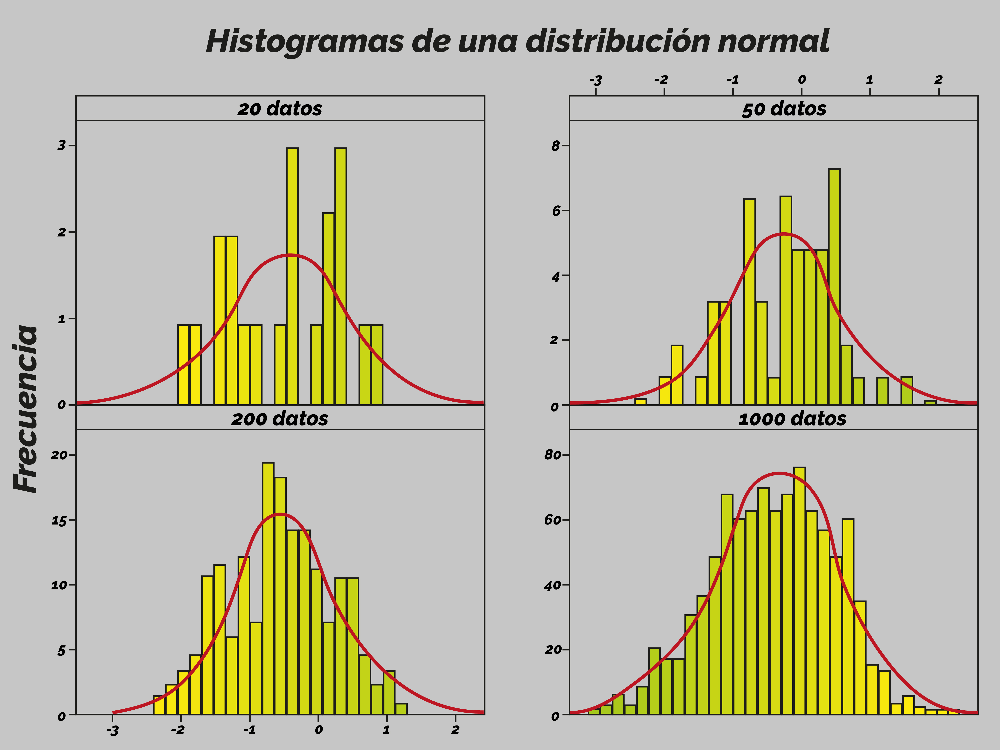

### Box plots o Gráficos de cajas

Muestran la distribución de un conjunto de datos a través de cuartiles.
- Muestra la mediana, los cuartiles y los valores  atipocos
- Uitilies para identificar dispersión , asimetría y los valores atípicos.

#### Video
Deben estar agrupados en columnas de manera puntual.
- Se identifica:
    - X minima
    - Cuartil 1
    - Cuartil 2
    - Cuartil 3
    - X máximo
Los cualtiles son numeros de posición dada por la ecuación: Q1= (k*n)/4
- k: numero del cuartil
- n: numero de datos
    Donde el resultado Q1 sera el numero de la posición a la que corresponde el cuartil.
Para calcualr los datos atipicos leves:
- fmin= Q1 - 1,5 (R1)
- fmin= Q3 + 1,5 (R1)
    - R1 es el dato intercualtilico= Q3 - Q1
Donde todos los valores que esten entre los fmin y fmax  son normales y los ue estan fura son los atipicos.
Para los datos atipicos extremos seria:
- fmin= Q1 - 3 (R1)
- fmin= Q3 + 3 (R1)

##### Se grafica
 - Una escala horizontal o vertical de valores
 - Se marcan el minimo y el maximo unidos por una linea (si no es un agrafica con valores atipicos)
 - Los valores de los cuartiles se grafican como lineas verticales y son cerrados formando una caja
 - Y si se tieen los datos atipicos 
    - Se marcan los valores de fmin y fmax y se unen con una liena
    - los valores atipicos se deben marcar
    - los cuartiles tambien se grafican.
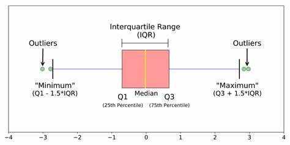

### Gráficos de Densidad o de densidad de kernel (KDE).
- Estiman la densidad de probabilidad de uan variable continua
- Suavisan los datos
- Permiten visualizacion más fluida.

#### Video
- La mediana es el valor donde la mitad de los valores es mayor y la otra es mitad es menor.
    - En graficos de densidad simetricos la mediana esta en la mitad del grafico
    - Para graficos de densidad asimetricos esta desplazada hacia  la izquierda o derecha 
_SE DEBE TENR EN CUENTA QUE ES EL VALOR DONDE SE DIVIDE EL GRAFICO EN DOS DONDE EL AREA DE AMBOS LADOS ES IGUAL_

- La media es tomar todos los valores y los ponderamos por la frecuencia con la que aparecen y se suman.
    - Para graficos simetricos la media y la mediana coinciden
    - Para graficos asimetricos donde si los datos estan desplazados hacia la derecha (asimetrica a la derecha) la media esta hacia la derecha y con los graficos desviados hacia la izquierda (asimetrica a la izquierda) pasara lo contrario.
 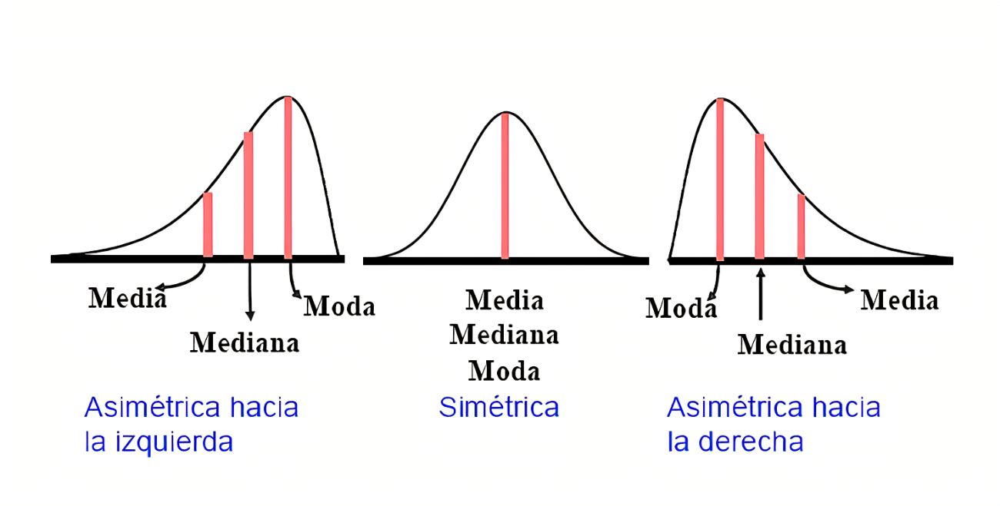

 ## MATERIA  COMPPLEMENTARIOS
 ### tipos de datos
 - Cualitativos: se refieren a cualidads o modalidades que no se expresan numericamente. Pueden ser:
    - Ordinales: sigue un orden
    - Categóricos: Sin orden
- Cualitativos: Se refire a cantidades. Pueden ser:
    - Discretos: si son de numeros enteros
    - Continuos: pueden tomar cualquier valro dentro de un intervalo
### Tipo de graficos
- De Barras 
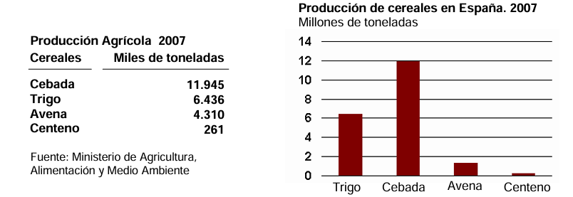
    - Verticales
    - Horizontales
    Pueden ser:
        - Sencillas
        - Agrupados
        - Apilado
    Tambien puede ser.
        - Histogramas
        - Bi-direccionales

             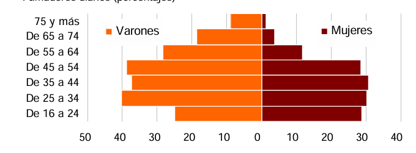

- Piramides de población
    - Progresiva
    - Regresiva
    - Estancada
    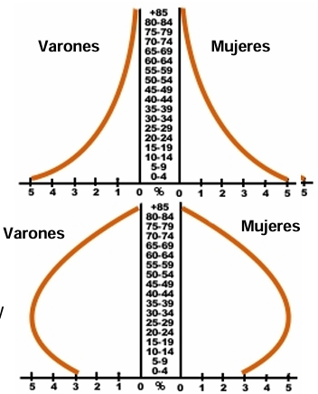

- De lineas: se represente en un eje cartesisano y representa la relación entre dos variables.
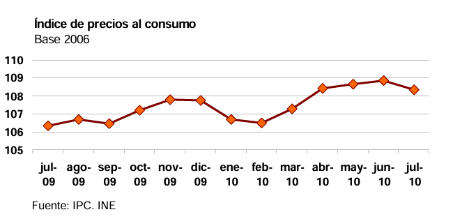

- Grafico de Pareto: es un grafico de barras ordenada por frecuencia
        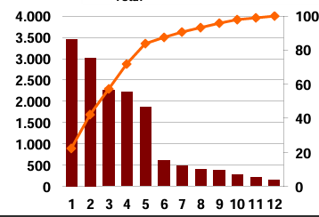

- De sectores: se representa de manera circular las frecuencias relativas.

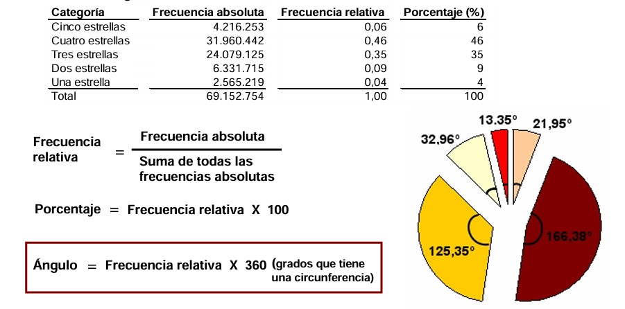

- Pictograma: Las barras son simbolos la frecuencia la representa el tamaño

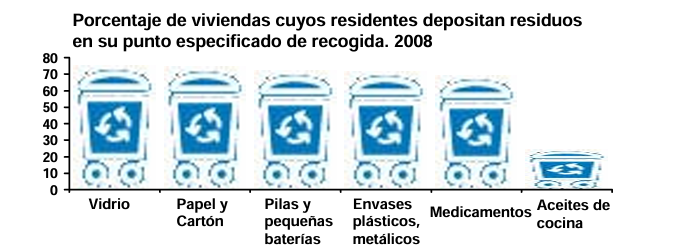

- Grafico de dispersión: muestra en un eje cartesiano la relaciónque existe entre dos variables atraves de puntos.
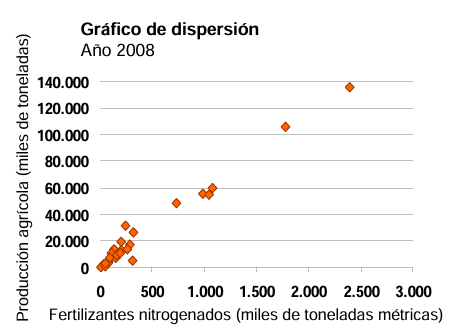
    Pueden tener correlacion:
    - Nula
    - Lineal
    - No linela

- Cartograma : es un arepresentacion de datos por regiones.

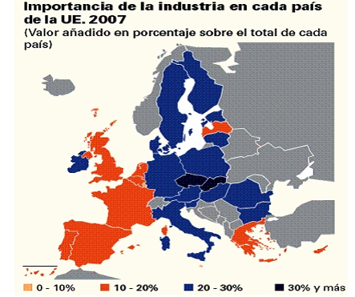